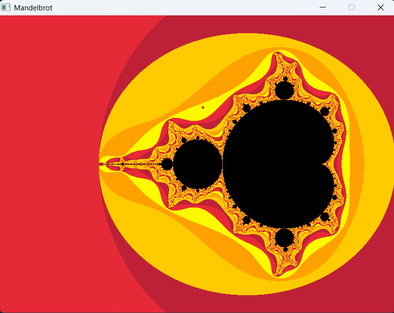
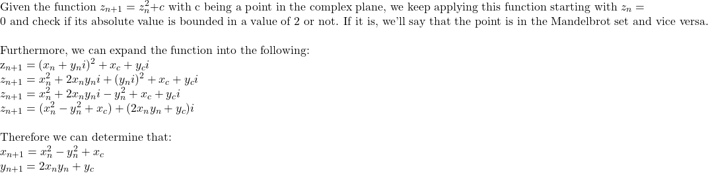

# Mandelbrot
My attempt at plotting the Mandelbrot set using Raylib.



## Build
```console
gcc main.c -o main.exe -I include/ -L lib/ -lraylib -lwinmm -lopengl32 -lgdi32
./main.exe
```

## References
https://en.wikipedia.org/wiki/Mandelbrot_set

https://courses.lumenlearning.com/waymakermath4libarts/chapter/generating-fractals-with-complex-numbers/

https://www.youtube.com/watch?v=NGMRB4O922I&ab_channel=Numberphile

## Intuition
